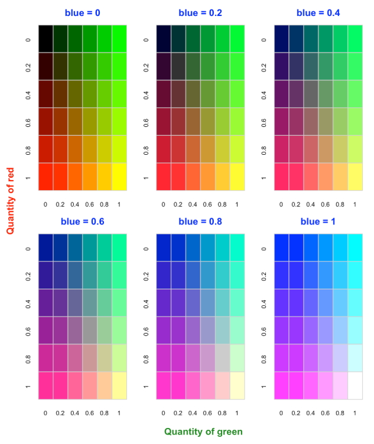
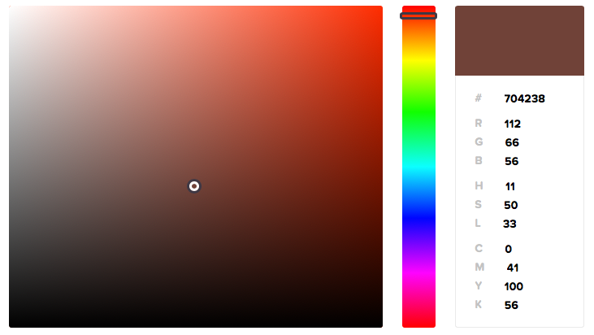
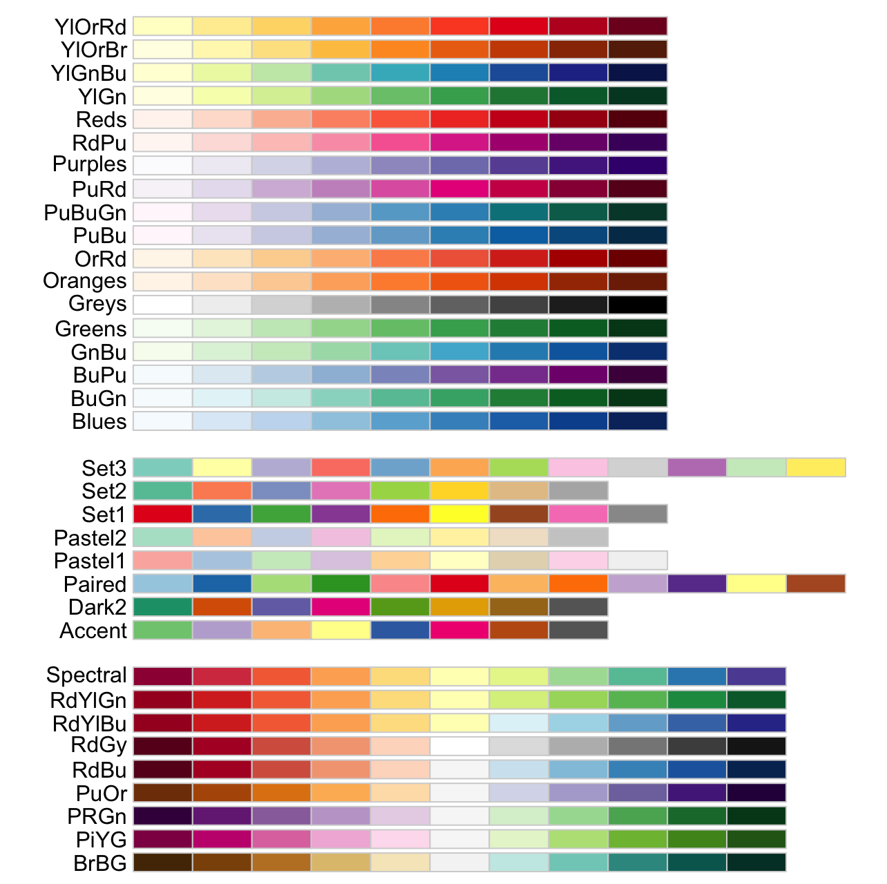
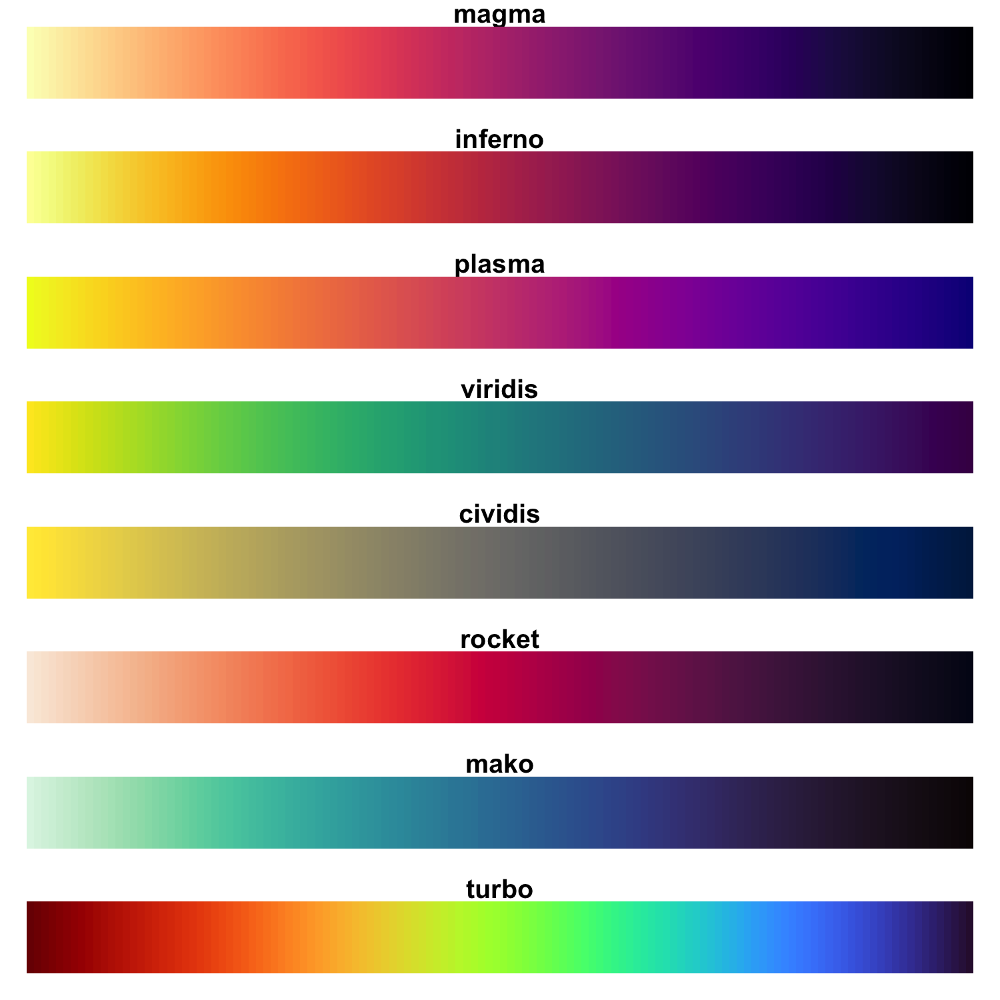
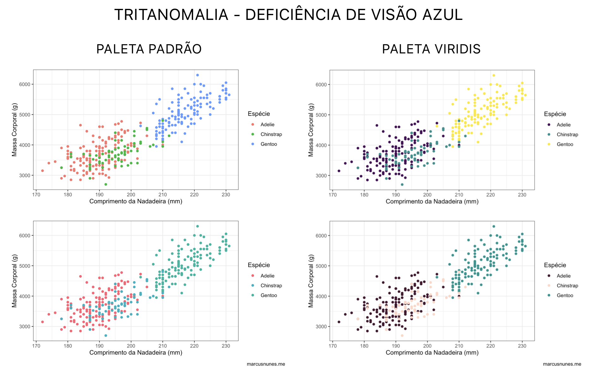
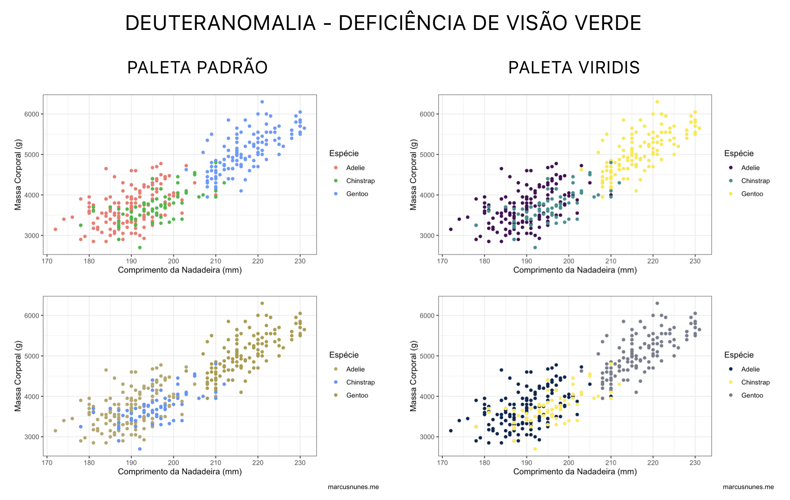
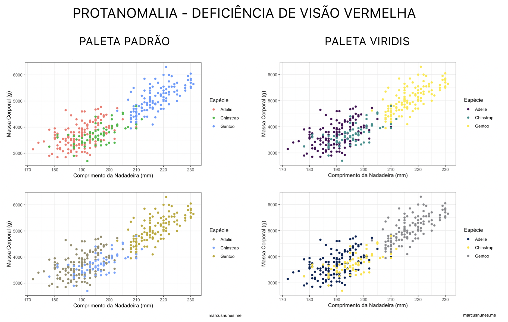
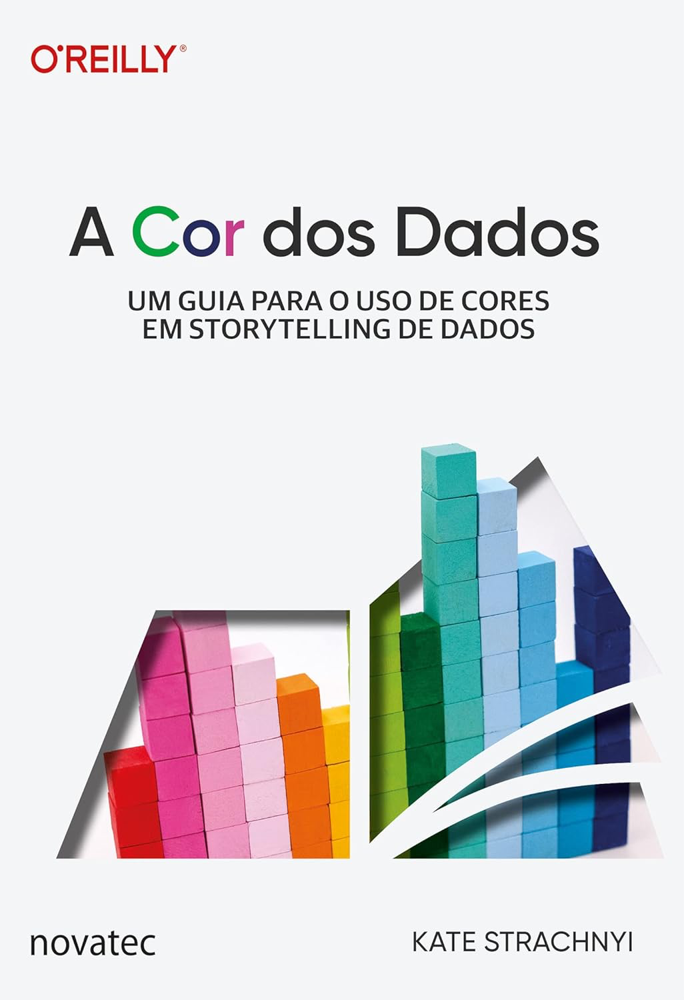

```{=html}
<style>
p {
  text-align: justify;
}
</style>
```

O ggplot2 permite personalizar as cores das formas com os argumentos:

-   fill - para áreas preenchidas, barras, caixas ou polígonos. Afeta a cor interna do objeto. Geoms comuns: `geom_bar()`, `geom_col(),` `geom_boxplot(),` `geom_histogram(),` `geom_area()` e `geom_tile()`.

-   color (ou colour) - para linhas, contornos e pontos. Afeta a borda ou traço do objeto. Geoms comuns: `geom_point(),` `geom_line()` e `geom_text().`

Quando se deseja usar uma **cor fixa**, basta especificá-la fora do `aes()`. Assim, todos os elementos da camada assumem a cor definida, independentemente dos valores dos dados. Por outro lado, quando as cores dependem de uma variável, elas devem ser definidas dentro do `aes()`, e o controle fino é feito por meio das **escalas de cor**.

Existem diferentes formas de definir uma cor:

NOME - usar o nome da cor (em inglês).

```{r}
colors()
```

RGB - escolher a quantidade de vermelho, verde e azul.

Exemplo: rgb(0.3, 0.5, 0.5)

{fig-align="center" width="384"}

HEX CODE - informar o código hexadecimal da cor.

Exemplo: #704238

{fig-align="center" width="320"}

Busque no navegador por *pick color* ou faça o download do seletor de cores *Instant Eyedropper* (Windows) ou *ColorSlurp* (Mac).

**Paletas**

Tipos de paletas:

-   Sequenciais: são adequadas para dados ordenados que progridem de baixo para alto. Os passos de luz dominam a aparência desses esquemas, com cores claras para valores de dados baixos e cores escuras para valores de dados altos.

-   Divergentes: colocam igual ênfase nos valores críticos de faixa média e nos extremos em ambas as extremidades do intervalo de dados. A classe crítica ou quebra no meio da lenda é enfatizada com cores claras e extremos baixos e altos são enfatizados com cores escuras que têm tons contrastantes.

-   Qualitativas: não implicam diferenças de magnitude entre as classes de lendas, e as tonalidades são usadas para criar as principais diferenças visuais entre as classes. Os esquemas qualitativos são mais adequados para representar dados nominais ou categóricos.

```{r}
# Função para exibir uma paleta
mostrar_paleta <- function(cores) { 
  n <- length(cores) 
  barplot(rep(1, n), col = cores, border = NA, space = 0, axes = FALSE)
}
```

[Manual]{.underline}

```{r}
# Cores nomeadas
mostrar_paleta(c("red", "darkgreen", "lightblue", "orange"))

# Cores RGB (https://colorhunt.co/palette/a3dc9adee791fff9bdffd6ba)
mostrar_paleta(c(rgb(163, 220, 154, maxColorValue = 255), rgb(222, 231, 145, maxColorValue = 255), rgb(255, 249, 189, maxColorValue = 255), rgb(255, 214, 186, maxColorValue = 255)))

# Código hexadecimal (https://paletter.beloweb.name/en/leaves-and-flower/)
mostrar_paleta(c("#ffa9b9", "#fcd5bd", "#f2ffbf", "#d9e99e", "#c0d27e"))
```

[Nativas]{.underline}

```{r}
mostrar_paleta(rainbow(5))
mostrar_paleta(heat.colors(5))   
mostrar_paleta(terrain.colors(5))
mostrar_paleta(topo.colors(5))   
mostrar_paleta(cm.colors(5))     
```

No ggplot2:

Discreta

`scale_color_manual(values = c(...))`

`scale_fill_manual(values = c(...))`

Contínua

`scale_color_gradient(low, high)`

`scale_fill_gradient(low, high)`

`scale_color_gradient2(low, mid, high, midpoint = ...)`

`scale_fill_gradient2(low, mid, high, midpoint = ...)`

`scale_color_gradientn(colors = c(...))`

`scale_fill_gradientn(colors = c(...))`

[Brewer]{.underline}

```{r}
library(RColorBrewer)
```

```{r, eval=FALSE}
display.brewer.all()
```

{fig-align="center" width="447"}

```{r}
mostrar_paleta(brewer.pal(5, "Set2"))
```

*No ggplot2:*

Discretas:

*scale_color_brewer(palette = "...")*

*scale_fill_brewer(palette = "...")*

Contínuas:

*scale_color_distiller(palette = "...")*

*scale_fill_distiller(palette = "...")*

[Viridis]{.underline}

```{r}
library(viridis)
```

{fig-align="center" width="400"}

```{r}
mostrar_paleta(viridis(5, option = "plasma"))
```

No ggplot2:

Discreta

`scale_color_viridis_d()`

`scale_fill_viridis_d()`

`scale_color_viridis(option = " ", discrete = TRUE)`

`scale_fill_viridis(option = " ", discrete = TRUE)`

Contínua

`scale_color_viridis_c()`

`scale_fill_viridis_c()`

`scale_color_viridis(option = " ", discrete = FALSE)`

`scale_fill_viridis(option = " ", discrete = FALSE)`

[Paletter]{.underline}

<https://pmassicotte.github.io/paletteer_gallery/>

```{r, eval = FALSE}
install.packages("nord")
install.packages("fishualize")
```

```{r}
library(paletteer)

mostrar_paleta(nord::nord("frost"))

mostrar_paleta(fishualize::fish(10, option = "Acanthisthius_brasilianus"))
```

No ggplot2:

Discreta

`scale_color_paletteer_d("nationalparkcolors::Acadia")` `scale_fill_paletteer_d("nationalparkcolors::Acadia")` `paletteer_d("nationalparkcolors::Acadia")`

Contínua

`scale_color_paletteer_c("ggthemes::Red-Green-White Diverging")` `scale_fill_paletteer_c("ggthemes::Red-Green-White Diverging")` `paletteer_c("ggthemes::Red-Green-White Diverging")`

[colorspace]{.underline}

[https://colorspace.r-forge.r-project.org/articles/ggplot2_color_scales.html](https://colorspace.r-forge.r-project.org/articles/ggplot2_color_scales.html#available-palettes)

O pacote oferece paletas qualitativas, sequenciais e divergentes baseadas em HCL, totalmente integradas ao ggplot2. HCL refere-se ao espaço de cor cilíndrico Hue (Matiz), Chroma (Croma) e Lightness (Luminância).

```{r}
library(colorspace)

hcl_palettes()

hcl_palettes(plot = TRUE)

mostrar_paleta(hcl.colors(10, palette = "Cork"))
```

No ggplot2:

As escalas são chamadas através do esquema:

scale\_`aesthetic`\_`datatype`\_`colorscale`()

Onde:

`aesthetic` é o nome da estética (fill, color, colour).

`datatype` é o tipo da variável plotada (discrete, continuous).

`colorscale` define o tipo de escala de cores usada (qualitative, sequential, diverging).

Escalas qualitativas:

*scale\_\*\_discrete_qualitative(palette = "name")*

Escalas sequenciais:

scale\_\*\_*discrete_sequential(palette = "name")*

*scale\_\*\_continuous_sequential(palette = "name")*

Escalas divergentes:

scale\_\*\_*discrete_diverging(palette = "name")*

*scale\_\*\_continuous_diverging(palette = "name")*.

[ggsci]{.underline}

<https://nanx.me/ggsci/articles/ggsci.html>

O pacote oferece uma coleção de paletas de cores de alta qualidade inspiradas em cores usadas em periódicos científicos, bibliotecas de visualização de dados, filmes de ficção científica e programas de TV.

```{r}
library(ggsci)

# AAAS (Science)
mostrar_paleta(pal_aaas("default")(10))

# NEJM (New England Journal of Medicine)
mostrar_paleta(pal_nejm("default")(8))

# Simpsons
mostrar_paleta(pal_simpsons()(7))
```

```{r, echo = FALSE}
library(tidyverse)
```

**Aplicação**

[Paletas discretas]{.underline}

```{r}
(p1 <- ggplot(mtcars, aes(x = factor(cyl), y = mpg, fill = factor(cyl))) +
  geom_boxplot() +
  labs(title = "Paleta padrão", x = "Cilindros", y = "Milhas por galão") +
  theme_minimal() +
  theme(plot.title = element_text(hjust = 0.5),
        legend.position = "none"))

p1 +   
  scale_fill_manual(values = c("red", "blue", "green")) +
  ggtitle("Paleta customizada manual")

library(RColorBrewer)
p1 + 
  scale_fill_brewer(palette = "Set2") +
  ggtitle("Paleta RColorBrewer Set2")

library(viridis)
p1 +
  scale_fill_viridis_d(option = "mako") +
  ggtitle("Paleta viridis mako")

library(paletteer)
p1 +
  scale_fill_paletteer_d("nationalparkcolors::Acadia") +
  ggtitle("Paletteer Acadia")

library(colorspace)
p1 +
  scale_fill_discrete_qualitative(palette = "Cold") +
  ggtitle("Colorspace Cold HCL palette's")

library(ggsci)
p1 +
  scale_fill_startrek() +
  ggtitle("Paleta ggsci startrek")
```

Paletas contínuas

```{r}
mtcars$carro <- rownames(mtcars)

(p2 <- ggplot(mtcars, aes(x = reorder(carro, mpg), y = mpg, fill = mpg)) +
  geom_col() +
  coord_flip() +
  labs(title = "Paleta padrão", x = "Modelo", y = "Milhas por galão") +
  theme_minimal() +
  theme(axis.text.x = element_text(angle = 90, hjust = 1),
        plot.title = element_text(hjust = 0.5), 
        legend.position = "none"))

library(RColorBrewer)
p2 + 
  scale_fill_distiller(palette = "PuBuGn") +
  ggtitle("Paleta RColorBrewer PuBuGn")

library(viridis)
p2 +
  scale_fill_viridis_c(option = "D") +
  ggtitle("Paleta viridis")

library(paletteer)
p2 +
  scale_fill_paletteer_c("ggthemes::Orange-Blue Diverging") +
  ggtitle("Paletteer ggthemes Orange-Blue")

library(colorspace)
p2 +
  scale_fill_continuous_sequential(palette = "Purple-Blue") +
  ggtitle("Colorspace Purple-Blue HCL palette's")

library(ggsci)
p2 +
  scale_fill_tw3("teal") +
  ggtitle("Paleta ggsci startrek")
```

Encontre a melhor paleta para seu tipo de gráfico: <https://r-graph-gallery.com/color-palette-finder>

Uma forma de promover a inclusão de pessoas com algum tipo de distúrbio visual é a utilização de paletas de cores acessíveis. Essas paletas são projetadas para garantir boa legibilidade e contraste, independentemente de limitações visuais, como o daltonismo. Um exemplo bastante utilizado é a **paleta *viridis::viridis***, que foi desenvolvida com critérios de perceptibilidade uniforme, garantindo que as diferenças entre as cores sejam facilmente distintas em gráficos, além de manter boa legibilidade tanto em telas quanto em impressões em escala de cinza.

{fig-align="center" width="700"}

{fig-align="center" width="700"}

{fig-align="center" width="700"}

Em vez de usar uma escala de cor tradicional (univariada), podemos combinar duas variáveis simultaneamente em uma matriz de cores (geralmente 2×2, 3×3 ou 4x4) usando o pacote `biscale`. A função bi_class() transforma variáveis contínuas em classes (por quantis, por exemplo), enquanto bi_scale_color() aplica a paleta bivariada e bi_legend() gera uma legenda interpretável.

```{r}
library(biscale)
library(cowplot)
library(grid)

mtcars_bi <- mtcars %>%
  bi_class(
    x = mpg,
    y = hp,
    style = "quantile",
    dim = 3
  ) %>% 
  select(mpg, hp, bi_class)

head(mtcars_bi)

grafico_mtcars <- ggplot(mtcars_bi, aes(x = mpg, y = hp, color = bi_class)) +
  geom_point(size = 4) +
  bi_scale_color(pal = "DkBlue", dim = 3) +
  labs(
    title = " ",
    x = "Milhas por galão (mpg)",
    y = "Potência (hp)"
  ) +
  theme_bw() +
  theme(legend.position = "none")

legenda_mtcars <- bi_legend(
  pal = "DkBlue",
  dim = 3,
  xlab = "Maior mpg",
  ylab = "Maior hp",
  size = 8
)

g_legend <- ggplotGrob(legenda_mtcars)

plot_grid(
  grafico_mtcars,
  legenda_mtcars,
  ncol = 2,
  rel_widths = c(3, 1)
)

grafico_mtcars +
  theme_classic() +
  theme(legend.position = "none") +
  annotation_custom(
    grob = g_legend,
    xmin = 23, xmax = 33,   
    ymin = 200, ymax = 350
  )

mtcars_bi2 <- mtcars %>%
  bi_class(
    x = hp,      
    y = qsec,    
    style = "quantile",
    dim = 2
  )

grafico_mtcars2 <- ggplot(
  mtcars_bi2,
  aes(
    x = wt,          
    y = mpg,         
    color = bi_class 
  )
) +
  geom_point(size = 4, alpha = 0.9) +
  bi_scale_color(pal = "Brown", dim = 2) +
  labs(
    title = " ",
    x = "Peso do carro (wt)",
    y = "Milhas por galão (mpg)"
  ) +
  theme_bw() +
  theme(legend.position = "none")

legenda_mtcars2 <- bi_legend(
  pal = "Brown",
  dim = 2,
  xlab = "Maior hp",
  ylab = "Maior qsec",
  size = 8
)

plot_grid(
  grafico_mtcars2,
  legenda_mtcars2,
  ncol = 2,
  rel_widths = c(3, 1)
)

penguins_bi <- palmerpenguins::penguins %>%
  drop_na(bill_length_mm, body_mass_g, species) %>%
  bi_class(
    x = bill_length_mm,
    y = body_mass_g,
    style = "quantile",
    dim = 3
  ) %>% 
  select(bill_length_mm, body_mass_g, species, bi_class)

head(penguins_bi)

grafico_penguins <- ggplot(
  penguins_bi,
  aes(
    x = bill_length_mm,
    y = body_mass_g,
    color = bi_class,
    shape = species
  )
) +
  geom_point(size = 3, alpha = 0.8) +
  bi_scale_color(pal = "GrPink", dim = 3) +
  labs(
    title = " ",
    x = "Comprimento do bico (mm)",
    y = "Massa corporal (g)",
    shape = "Espécie"
  ) +
  theme_bw() +
  guides(color = "none") +
  theme(legend.position = "top")

legenda_penguins <- bi_legend(
  pal = "GrPink",
  dim = 3,
  xlab = "Maior comprimento do bico",
  ylab = "Maior massa corporal",
  size = 6
)

g_legend <- ggplotGrob(legenda_penguins)

plot_grid(
  grafico_penguins,
  legenda_penguins,
  ncol = 2,
  rel_widths = c(3, 1)
)

grafico_penguins +
  theme_classic() +
  annotation_custom(
    grob = g_legend,
    xmin = 30, xmax = 40,   
    ymin = 5000, ymax = 6500
  )

penguins_bi2 <- palmerpenguins::penguins %>%
  drop_na(
    bill_length_mm,
    body_mass_g,
    flipper_length_mm,
    bill_depth_mm
  ) %>%
  bi_class(
    x = flipper_length_mm, 
    y = bill_depth_mm,     
    style = "quantile",
    dim = 4
  )

grafico_penguins2 <- ggplot(
  penguins_bi2,
  aes(
    x = bill_length_mm, 
    y = body_mass_g,    
    color = bi_class    
  )
) +
  geom_point(size = 3, alpha = 0.85) +
  bi_scale_color(pal = "PurpleOr", dim = 4) +
  labs(
    title = "",
    x = "Comprimento do bico (mm)",
    y = "Massa corporal (g)"
  ) +
  theme_bw() +
  theme(legend.position = "none")

legenda_penguins2 <- bi_legend(
  pal = "PurpleOr",
  dim = 4,
  xlab = "Maior comprimento da nadadeira",
  ylab = "Maior profundidade do bico",
  size = 8
)

plot_grid(
  grafico_penguins2,
  legenda_penguins2,
  ncol = 2,
  rel_widths = c(3, 1)
)
```

Leitura recomendada:

{fig-align="center" width="242"}
