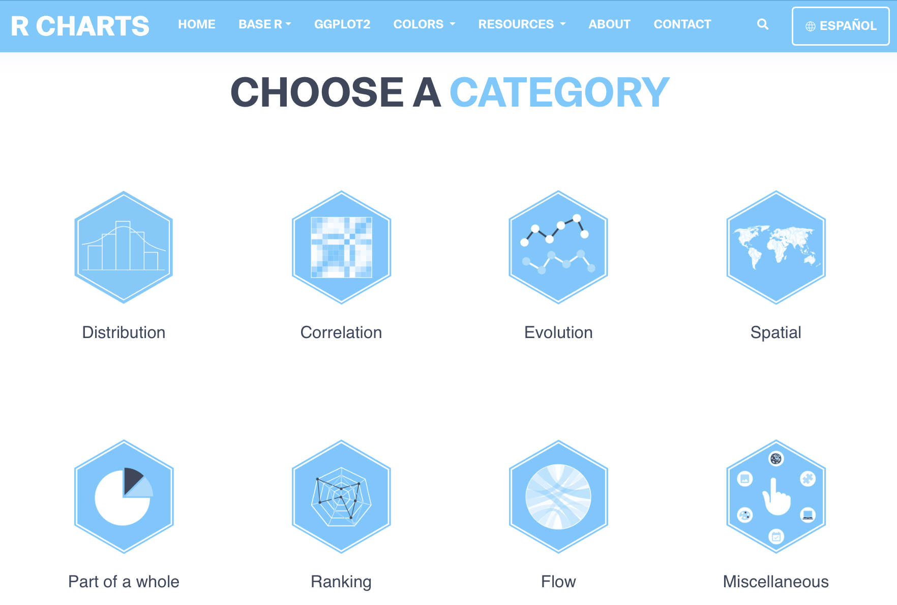

```{=html}
<style>
p {
  text-align: justify;
}
</style>
```

Escolher o tipo de gráfico adequado para os dados é fundamental para garantir uma comunicação clara e eficaz das informações. Cada conjunto de dados possui características específicas, como variáveis contínuas e/ou categóricas, e selecionar o gráfico correto ajuda a destacar padrões, tendências e relações que poderiam passar despercebidos. Um gráfico mal escolhido pode confundir o leitor ou até mesmo transmitir uma interpretação errada dos dados, comprometendo a tomada de decisão baseada neles.

[{width="800"}](https://r-graph-gallery.com)

[{fig-align="center" width="600"}](https://r-charts.com)

```{r}
library(tidyverse)

dados1 <- palmerpenguins::penguins %>% na.omit() 
summary(dados1)

dados2 <- as.data.frame(Titanic)
summary(dados2)

dados3 <- gapminder::gapminder
summary(dados3)
```

## 1 variável numérica

```{r}
# Violin
(g1 <- ggplot(dados1, aes(x = species, y = body_mass_g, fill = species)) +
  geom_violin(trim = FALSE) +
  labs(title = "Violin", x = "Espécie", y = "Massa corporal (g)") +
  theme_minimal() +
  theme(legend.position = "none", plot.title = element_text(hjust = 0.5)))

# Density
(g2 <- ggplot(dados1, aes(x = body_mass_g, fill = species)) +
  geom_density(alpha = 0.5) + 
  labs(title = "Density",
       x = "Massa corporal (g)", y = "Densidade", fill = "Espécie") +
  theme_minimal() +
  theme(plot.title = element_text(hjust = 0.5)))

# Histogram
(g3 <- ggplot(dados1, aes(x = body_mass_g, fill = species)) +
  geom_histogram(bins = 30, alpha = 0.6, position = "identity") +
  labs(title = "Histogram",
       x = "Massa corporal (g)", y = "Frequência", fill = "Espécie") +
  theme_minimal() +
  theme(plot.title = element_text(hjust = 0.5)))

# Boxplot
(g4 <- ggplot(dados1, aes(x = species, y = body_mass_g, fill = species)) +
  geom_boxplot() +
  labs(title = "Boxplot",
       x = "Espécie", y = "Massa corporal (g)") +
  theme_minimal() +
  theme(legend.position = "none", plot.title = element_text(hjust = 0.5)))

# Ridgeline
library(ggridges) 
(g5 <- ggplot(dados1, aes(x = body_mass_g, y = species, fill = species)) +
  geom_density_ridges(alpha = 0.6) +
  labs(title = "Ridgeline",
       x = "Massa corporal (g)", y = "Espécie") +
  theme_minimal() +
  theme(legend.position = "none", plot.title = element_text(hjust = 0.5)))

# Beeswarm
library(ggbeeswarm) 
(g6 <- ggplot(dados1, aes(x = species, y = body_mass_g, color = species)) +
  geom_beeswarm(cex = 0.5) +
  labs(title = "Beeswarm",
       x = "Espécie", y = "Massa corporal (g)") +
  theme_minimal() +
  theme(legend.position = "none", plot.title = element_text(hjust = 0.5)))
```

## 2 variáveis numéricas

```{r}
# Scatter
(g1 <- ggplot(dados1, aes(x = bill_length_mm, y = bill_depth_mm)) +
  geom_point(aes(color = species)) +
  labs(title = "Scatter",
       x = "Comprimento do bico (mm)", y = "Profundidade do bico (mm)", color = "Espécie") +
  theme_minimal() +
  theme(plot.title = element_text(hjust = 0.5)))
```

**Linhas de referência**

```{r}
(gh <- ggplot(dados1, aes(x = flipper_length_mm, y = body_mass_g)) +
  geom_point(size = 3, color = "blue") +
  geom_hline(yintercept = median(dados1$body_mass_g),
             linetype = "dashed", color = "red") +
  labs(title = "Scatter com linha de referência da mediana da massa corporal",
       x = "Flipper length (mm)", y = "Body mass (g)") +
  theme_minimal() +
  theme(plot.title = element_text(hjust = 0.5)))
```

```{r}
(gv <- ggplot(dados1, aes(x = flipper_length_mm, y = body_mass_g)) +
  geom_point(size = 3, color = "blue") +
  geom_vline(xintercept = mean(dados1$flipper_length_mm),
             linetype = "dotted", linewidth = 1.5, color = "red") +
  labs(title = "Scatter com linha de referência da média do comprimento da nadadeira",
       x = "Flipper length (mm)", y = "Body mass (g)") +
  theme_minimal() +
  theme(plot.title = element_text(hjust = 0.5)))
```

## 1 variável numérica e 1 variável categórica

```{r}
# Line 
gap1 <- dados3 %>% 
  filter(country == "Brazil")

(g1 <- ggplot(gap1, aes(x = year, y = gdpPercap)) +
  geom_line(color = "blue") +
  labs(title = "PIB per capita ao longo dos anos no Brasil", 
       x = "Ano", 
       y = "PIB per capita") +
  theme_minimal() +
  theme(plot.title = element_text(hjust = 0.5)))

g1 + geom_point()

g1 + geom_point(color = "red", shape = 5)

# Area
(g2 <- ggplot(gap1, aes(x = year, y = gdpPercap)) +
  geom_area(fill = "blue", color = "blue", alpha = 0.5) +
  labs(title = "PIB per capita ao longo dos anos no Brasil", 
       x = "Ano", 
       y = "PIB per capita") +
  theme_minimal() +
  theme(plot.title = element_text(hjust = 0.5)))
```

## 2 variáveis categóricas e 1 numérica

```{r}
# Heatmap
ggplot(dados1, aes(x = species, y = sex, fill = flipper_length_mm)) +
  geom_tile(color = "white") +
  scale_fill_gradient(low = "red", high = "blue", limits = c(150, 220)) +
  labs(
    title = "Heatmap",
    x = "Espécie",
    y = "Sexo",
    fill = "Comprimento da nadadeira"
  ) +
  theme_minimal() +
  theme(plot.title = element_text(hjust = 0.5))
```

## Várias variáveis categóricas

```{r}
# Aluvial
library(ggalluvial)

ggplot(dados2,
       aes(axis1 = Class, axis2 = Sex, axis3 = Age, axis4 = Survived, y = Freq)) +
  geom_alluvium(aes(fill = Survived), width = 1/12) +
  geom_stratum(width = 1/12, fill = "gray", color = "black") +
  geom_text(stat = "stratum", aes(label = after_stat(stratum)), size = 3) +
  scale_x_discrete(limits = c("Class", "Sex", "Age", "Survived"), expand = c(.05, .05)) +
  labs(title = "Alluvial", y = "Frequency", x = NULL) +
  theme_minimal() +
  theme(plot.title = element_text(hjust = 0.5))
```

## Contagem de classes de variáveis categóricas

```{r}
# Col - usa os valores que você fornece em y
resumo <- dados1 %>%
  group_by(species) %>%
  summarise(contagem = n(), .groups = "drop")

(g1 <- ggplot(resumo, aes(x = species, y = contagem)) +
  geom_col(fill = "darkgreen") +
  labs(title = "Col", x = "Espécie", y = "Contagem") +
  theme_minimal() +
  theme(plot.title = element_text(hjust = 0.5)))

# Bar - calcula contagem automaticamente
(g1 <- ggplot(dados1, aes(x = species)) +
  geom_bar(fill = "darkgreen") +
  theme_minimal() +
  labs(title = "Bar", y = "Contagem", x = "Espécie") +
  theme(plot.title = element_text(hjust = 0.5)))

# stat = "identity": não calcular contagem, usar o y fornecido
(g1 <- ggplot(resumo, aes(x = species, y = contagem)) +
  geom_bar(stat = "identity", fill = "darkgreen") +
  theme_minimal() +
  labs(title = "Bar", y = "Contagem", x = "Espécie") +
  theme(plot.title = element_text(hjust = 0.5)))

# Lollipop
df_count <- dados1 %>% count(species)

(g2 <- ggplot(df_count, aes(x = species, y = n)) +
  geom_segment(aes(x = species, xend = species, y = 0, yend = n), color = "darkgreen") +
  geom_point(size = 4, color = "green") +
  labs(title = "Lollipop", x = "Espécie", y = "Contagem") +
  theme_minimal() +
  theme(plot.title = element_text(hjust = 0.5)))
```

## Contagem de classes de uma variável categórica

```{r}
# Stacked bar
(g1 <- ggplot(dados1, aes(x = island, fill = species)) +
  geom_bar(position = "stack") +
  theme_minimal() +
  labs(title = "Stacked Bar", x = "Ilha", y = "Contagem") +
  theme(plot.title = element_text(hjust = 0.5)))

# Grouped bar
(g2 <- ggplot(dados1, aes(x = island, fill = species)) +
  geom_bar(position = "dodge") + 
  theme_minimal() +
  labs(title = "Grouped Bar", x = "Ilha", y = "Contagem") +
  theme(plot.title = element_text(hjust = 0.5)))

# Pie 
pie_data <- dados1 %>% 
  count(species) %>% 
  mutate(frac = n/sum(n), label = paste(round(100 * frac, 1), "%"))

(g3 <- ggplot(pie_data, aes(x="", y = frac, fill = species)) +
  geom_bar(stat = "identity") +
  coord_polar("y") +
  geom_text(aes(label = label),
            position = position_stack(vjust = 0.5), 
            color = "white", size = 4) +
  theme_void() +
  labs(title = "Pie", fill = "Espécie") +
  theme(plot.title = element_text(hjust = 0.5)))
```

## Adição de estatísticas

```{r}
# Boxplot com média e mediana
ggplot(dados1, aes(x = species, y = body_mass_g)) +
  geom_boxplot(fill = "lightgreen") +
  stat_summary(fun = mean, geom = "point", shape = 20, size = 3, color = "red") +
  stat_summary(fun = median, geom = "point", shape = 18, size = 3, color = "blue") +
  labs(x = "Espécie", y = "Massa corporal (g)") +
  theme_minimal()

# Média ± erro padrão 
ggplot(dados1, aes(x = species, y = body_mass_g)) +
  stat_summary(fun = mean, geom = "point", size = 3, color = "blue") +
  stat_summary(fun.data = mean_se, geom = "errorbar", width = 0.2, color = "black") +
  labs(x = "Espécie", y = "Massa corporal (g)") +
  theme_minimal()

# Regressão linear: flipper_length_mm ~ body_mass_g

adelie <- dados1 %>% 
  filter(species == "Adelie")

(g <- ggplot(adelie, aes(x = body_mass_g, y = flipper_length_mm)) +
  geom_point(alpha = 0.7) +
  geom_smooth(method = "lm", formula = y ~ x, se = FALSE, color = "red") +
  labs(x = "Massa corporal (g)", y = "Flipper length (mm)", color = "Espécie") +
  theme_minimal())

library(ggpmisc)

g + stat_poly_eq(formula = y ~ x, 
                 eq.with.lhs = "italic(y)~`=`~", 
                 aes(label = paste(..eq.label.., 
                                   ..rr.label.., 
                                   sep = "~")), 
                 parse = TRUE)

g + stat_poly_eq(formula = y ~ x,
                 eq.with.lhs = "italic(y)~`=`~",
                 aes(label = paste("atop(", ..eq.label.., ",",
                                   ..rr.label.., ")")),
                 parse = TRUE,
                 color = "blue") 


ggplot(dados1, aes(x = body_mass_g, y = flipper_length_mm, color = species)) +
  geom_point(alpha = 0.7) +
  geom_smooth(method = "lm", formula = y ~ x, se = FALSE) +
  stat_poly_eq(aes(label = paste(..eq.label.., ..rr.label.., sep = "~~~")),
               formula = y ~ x, parse = TRUE, label.x.npc = "left", label.y.npc = 0.95) +
  labs(x = "Massa corporal (g)", y = "Flipper length (mm)", color = "Espécie") +
  theme_minimal()
```

```{r}
library(broom)
library(glue)

p1 <- dados1 %>%
  group_by(species, sex) %>%
  summarise(
    model = list(lm(body_mass_g ~ flipper_length_mm, data = cur_data())),
    .groups = "drop"
  ) %>%
  mutate(
    intercept = purrr::map_dbl(model, ~coef(.x)[1]),
    slope = purrr::map_dbl(model, ~coef(.x)[2]),
    r2 = purrr::map_dbl(model, ~summary(.x)$r.squared),
    p = purrr::map_dbl(model, ~summary(.x)$coefficients[2,4]),
    pretty_stats = glue(
    "y = {round(slope,2)}x + {round(intercept,0)}<br>
    R<sup>2</sup> = {round(r2,3)}<br>
    P < 0.001"
))
```

```{r}
library(ggtext)

dados1 %>%
  ggplot(aes(x = flipper_length_mm,
             y = body_mass_g,
             color = species,
             shape = species)) +
    geom_jitter(alpha = 0.6,
              size = 1.4,
              show.legend = FALSE,
              position = position_jitter(width = 1.2, seed = 123)) +
  geom_smooth(method = "lm",
              formula = y ~ x,
              color = "black",
              se = FALSE,
              linewidth = 0.5) +
  
  geom_richtext(data = p1,
                aes(x = -Inf,
                    y = Inf,
                    label = pretty_stats),
                hjust = -0.05,
                vjust = 1.1,
                size = 2.8,
                label.padding = unit(0, "pt"),
                label.colour = NA,
                fill = NA,
                inherit.aes = FALSE) +
  facet_grid(species ~ sex,
             axes = "all",
             axis.labels = "margins") +
  theme_bw() +
  theme(
    strip.background = element_rect(fill = "lightblue"),
    strip.text = element_text(face = "bold"),
    panel.grid.minor = element_blank()
  ) +
  labs(x = "Flipper length (mm)",
       y = "Body mass (g)")
```

Pacotes específicos para gráficos com estatísticas:

-   [ggpubr](https://rpkgs.datanovia.com/ggpubr/)

-   [ggstatsplot](https://indrajeetpatil.github.io/ggstatsplot/)

-   [grafify](https://grafify.shenoylab.com)

-   [tidyplots](https://tidyplots.org)
