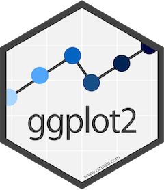
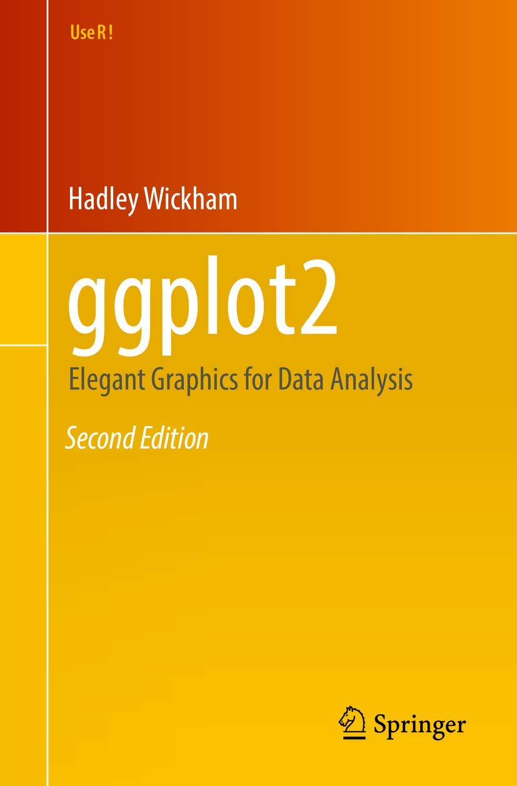
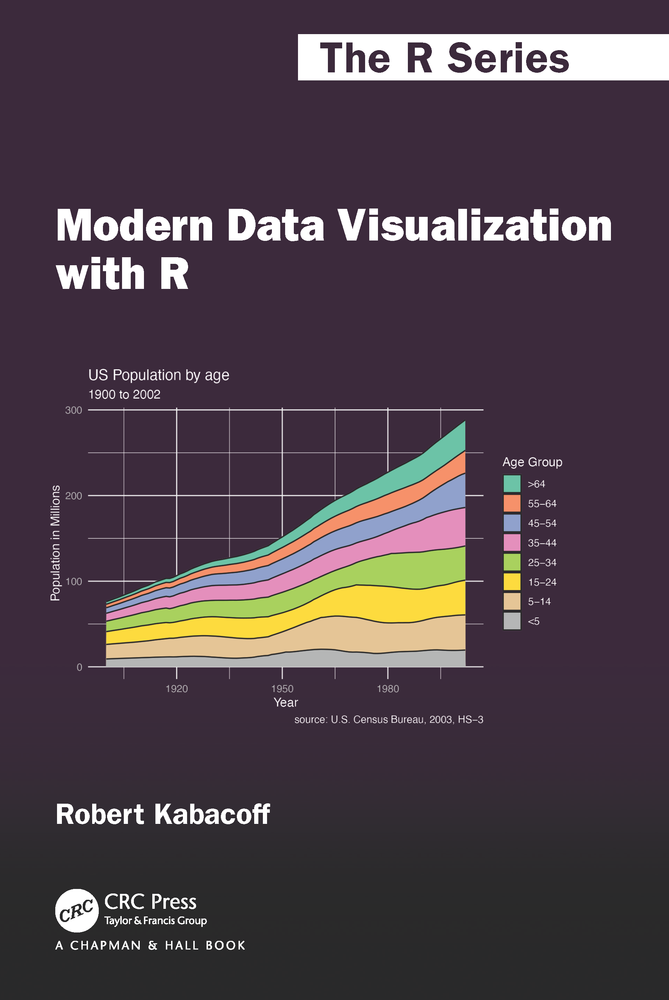
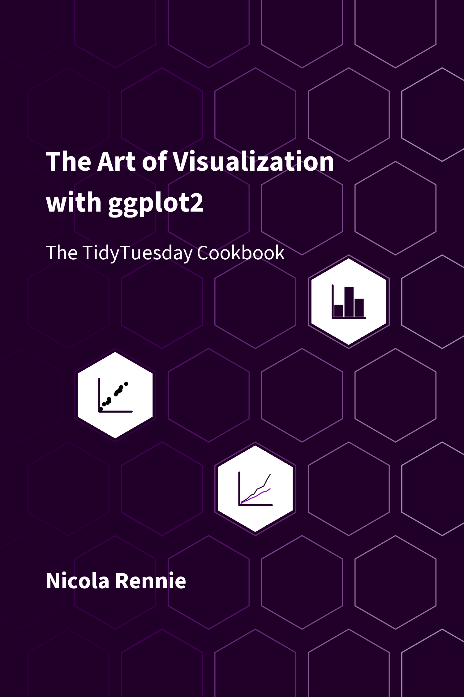
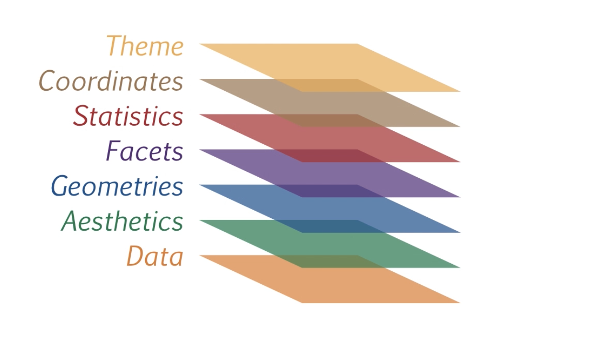
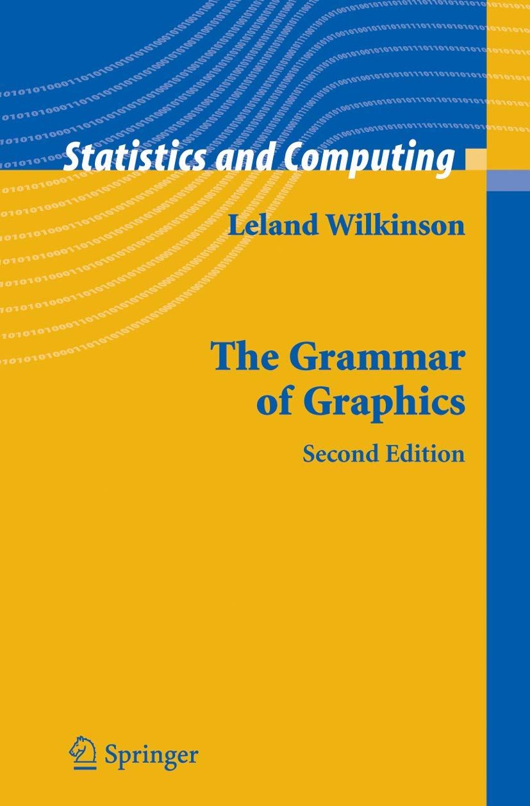
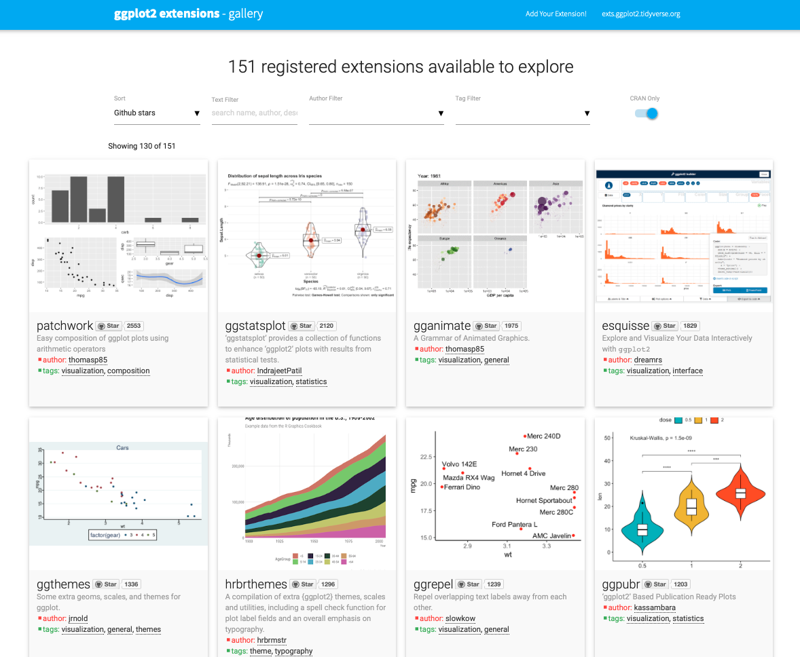

```{=html}
<style>
p {
  text-align: justify;
}
</style>
```

## ggplot2

[{fig-align="center" width="150"}](https://rstudio.github.io/cheatsheets/data-visualization.pdf)

[{fig-align="center" width="150"}](https://ggplot2-book.org)

[{fig-align="center" width="150"}](https://rkabacoff.github.io/datavis/)

[{fig-align="center" width="150"}](https://nrennie.rbind.io/art-of-viz/)

Embora o R possua diversas funções nativas para a visualização de dados, o pacote *ggplot2* se consolidou como a principal referência, graças à sua organização baseada na *Grammar of Graphics*.

{fig-align="center" width="400"}

Essa estrutura em camadas possibilita separar dados, mapeamentos estéticos, geometrias e escalas, facilitando a criação de gráficos mais claros, consistentes e personalizáveis.

{fig-align="center" width="173"}

**Mapeamento estético: aes()**

<https://ggplot2tor.com/aesthetics/>

Posição: x e y;

Cor: color;

Preenchimento: fill;

Transparência: alpha;

Tamanho: size;

Formato: shape;

```{r, echo = FALSE}
library(ggplot2)
shapes <- data.frame(
  shape = c(0:19, 20, 21, 22, 23, 24),
  x = 0:24 %/% 5,
  y = -(0:24 %% 5)
)
ggplot(shapes, aes(x, y)) + 
  geom_point(aes(shape = shape), size = 5, fill = "red") +
  geom_text(aes(label = shape), hjust = 0, nudge_x = 0.15) +
  scale_shape_identity() +
  expand_limits(x = 4.1) +
  theme_void()
```

**Geometrias: geom();**

```{r, echo=FALSE}
ls("package:ggplot2", pattern = "^geom_")
```

**Facetas:** permitem a criação de múltiplos gráficos divididos por uma ou mais variáveis (facet_wrap e facet_grid);

**Estatísticas:** permitem realizar cálculos e resumos dos dados diretamente no gráfico;

```{r, echo = FALSE}
ls("package:ggplot2", pattern = "^stat_")
```

**Coordenadas:** controlam o sistema de coordenadas do gráfico, permitindo ajustar a visualização dos dados e modificar a forma como eles são apresentados (coord_flip, coord_polar e coord_cartesian);

**Escalas:** permitem ajustar a forma como os dados são mapeados para as estéticas do gráfico, como cores, tamanhos e formas.

<https://ggplot2tor.com/scales/>

**Temas:** permitem personalizar a aparência visual dos gráficos, ajustando elementos estéticos como o fundo, as linhas de grade e os rótulos.

<https://ggplot2tor.com/theme/>

*Temas pré-definidos:*

```{r, echo=FALSE, fig_width=5, fig_height=8}
library(gridExtra)

# Gráfico base sem título
p <- ggplot(mtcars, aes(x = wt, y = mpg)) +
  geom_point(size = 3, color = "steelblue")

# Lista de temas disponíveis
temas <- list(
  theme_gray(),
  theme_bw(),
  theme_light(),
  theme_linedraw(),
  theme_minimal(),
  theme_classic(),
  theme_void(),
  theme_dark()
)

# Nomes dos temas
nomes_temas <- c("theme_gray", "theme_bw", "theme_light", 
                 "theme_linedraw", "theme_minimal", 
                 "theme_classic", "theme_void", "theme_dark")

# Criar gráficos aplicando cada tema com título centralizado
plots <- lapply(seq_along(temas), function(i) {
  p + 
    temas[[i]] + 
    ggtitle(nomes_temas[i]) +
    theme(plot.title = element_text(hjust = 0.5, size = 12, face = "bold"))
})

# Visualizar todos os gráficos juntos
do.call(grid.arrange, c(plots, ncol = 2))
```

**labs**(): é usada para modificar os rótulos de títulos e subtítulos (title e subtitle), eixos (x e y) e legendas (fill, color, shape, size e alpha).

[Justificação (h, v)]{.underline}

-   Horizontal: left = 0, center = 0.5, right = 1

-   Vertical: top = 1, middle = 0.5, bottom = 0

```{r, echo=FALSE}
just <- expand.grid(hjust = c(0, 0.5, 1), vjust = c(0, 0.5, 1))
just$label <- paste0(just$hjust, ", ", just$vjust)

ggplot(just, aes(hjust, vjust)) +
  geom_point(colour = "grey70", size = 5) + 
  geom_text(aes(label = label, hjust = hjust, vjust = vjust)) +
  labs(title = "POSIÇÕES") +
  theme_classic() +
  theme(plot.title = element_text(hjust = 0.5))
```

**Primeiro gráfico**

```{r}
library(ggplot2)

ggplot()

summary(mtcars)

ggplot(mtcars, aes(x = mpg))

ggplot(mtcars, aes(x = mpg)) +
  geom_histogram()

ggplot(mtcars, aes(x = mpg)) +
  geom_histogram(bins = 10, color = "black", fill = "lightblue") +
  labs(x = "Milhas por galão", y = "Quantidade", title = "Distribuição de milhas por Galão") +
  theme_classic() +
  theme(plot.title = element_text(hjust = 0.5))
```

Facetas

```{r}
ggplot(mtcars, aes(x = wt, y = mpg)) +
  geom_point() +
  facet_wrap(~ carb) +
  labs(title = "Número de carburadores", x = "Peso", y = "Milhas por galão") +
  theme_minimal() +
  theme(plot.title = element_text(hjust = 0.5))
```

```{r}
ggplot(mtcars, aes(x = wt, y = mpg)) +
  geom_point() +
  facet_wrap(~ carb, ncol = 2) +
  labs(title = "Número de carburadores", x = "Peso", y = "Milhas por galão") +
  theme_minimal() +
  theme(plot.title = element_text(hjust = 0.5))
```

```{r}
ggplot(mtcars, aes(x = wt, y = mpg)) +
  geom_point() +
  facet_wrap(~ carb, ncol = 2, scales = "free") +
  labs(title = "Número de carburadores", x = "Peso", y = "Milhas por galão") +
  theme_minimal() +
  theme(plot.title = element_text(hjust = 0.5))
```

```{r}
ggplot(mtcars, aes(x = wt, y = mpg)) +
  geom_point() +
  facet_grid(~ carb) +
  labs(title = "Número de carburadores", x = "Peso", y = "Milhas por galão") +
  theme_minimal() +
  theme(plot.title = element_text(hjust = 0.5))
```

```{r}
ggplot(mtcars, aes(x = wt, y = mpg)) +
  geom_point() +
  facet_grid(carb ~ cyl, labeller = labeller(carb = label_both)) +
  labs(title = "Número de Cilindros", x = "Peso", y = "Milhas por galão") +
  theme_bw() +
  theme(plot.title = element_text(hjust = 0.5))
```

Estética dinâmica

```{r}
ggplot(mtcars, aes(x = wt, y = mpg, color = as.factor(cyl), size = hp)) +
  geom_point() +
  labs(title = "Peso x Consumo por cilindros e potência", color = "cyl") +
  theme_minimal() +
  theme(plot.title = element_text(hjust = 0.5))
```

Sobreposição

```{r}
ggplot(mtcars, aes(x = wt, y = mpg)) +
  geom_point(color = "blue", size = 3) +
  geom_line(color = "red", linewidth = 1) +
  labs(title = " ", x = "Peso", y = "Milhas por galão") +
  theme_minimal()

ggplot(mtcars, aes(x = wt, y = mpg)) +
  geom_line(color = "red", linewidth = 1) +
  geom_point(color = "blue", size = 3) +
  labs(title = " ", x = "Peso", y = "Milhas por galão") +
  theme_minimal() 
```

**Exportação de gráficos**

```{r}
#Salvando o último gráfico plotado
ggsave(filename = "grafico.png",
       height = 5,                 #altura 
       width = 9,                  #largura
       dpi = 500)                  #qualidade
```

```{r}
library(tidyverse)
```

**Anotações**

Em um mundo inundado por dados, a capacidade de criar visualizações que facilitam a interpretação rápida e clara é mais crucial do que nunca.

*geom_text:* Serve para adicionar textos diretamente nos gráficos.

Estrutura: geom_text(aes(label = ...))

*geom_label:* Serve para adicionar textos dentro de caixas retangulares diretamente nos gráficos.

Estrutura: geom_label(aes(label = ...))

```{r}
df1 <- mtcars %>%
  group_by(cyl) %>%
  summarise(media_mpg = mean(mpg))

(ggplot(df1, aes(x = factor(cyl), y = media_mpg)) +
  geom_col(fill = "skyblue") +
  geom_text(aes(label = round(media_mpg, 1)), vjust = -0.5, size = 5) +
  ylim(0, 32))

(ggplot(df1, aes(x = factor(cyl), y = media_mpg)) +
  geom_col(fill = "skyblue") +
  geom_label(aes(label = round(media_mpg, 1)), vjust = -0.5, size = 5) +
  ylim(0, 35))
```

```{r}
df2 <- mtcars %>%
  count(gear) %>%
  mutate(perc = round(n / sum(n) * 100, 1))

(ggplot(df2, aes(x = factor(gear), y = n, fill = factor(gear))) +
  geom_col() +
  geom_text(aes(label = paste0(perc, "%")), vjust = -0.5) +
  ylim(0, 18))

(ggplot(df2, aes(x = factor(gear), y = n, fill = factor(gear))) +
  geom_col() +
  geom_label(aes(label = paste0(perc, "%")), vjust = -0.5) +
  ylim(0, 18))
```

```{r}
df3 <- mtcars %>%
  group_by(cyl) %>%
  summarise(media_hp = mean(hp))

ggplot(df3, aes(x = factor(cyl), y = media_hp)) +
  geom_col(fill = "orange") +
  geom_text(aes(label = round(media_hp, 1)), 
            vjust = 1.5, color = "white", size = 5)

ggplot(df3, aes(x = factor(cyl), y = media_hp)) +
  geom_col(fill = "orange") +
  geom_label(aes(label = round(media_hp, 1)), 
             vjust = 1.5, color = "white", fill = "black", size = 5)
```

```{r}
ggplot(mtcars, aes(x = wt, y = mpg, label = rownames(mtcars))) +
  geom_point(color = "red") +
  geom_text(vjust = -0.5, size = 3)

ggplot(mtcars, aes(x = wt, y = mpg, label = rownames(mtcars))) +
  geom_point(color = "red") +
  geom_label(vjust = -0.5, size = 3)
```

*annotate:* Serve para colocar textos, formas ou setas fixas no gráfico, sem necessidade de estarem ligados diretamente aos dados.

Estrutura: annotate(geom, x, y, ...)

-   `geom` → qual tipo de anotação você quer (`"text"`, `"label"`, `"rect"`, `"segment"`, `"point"` etc.).

-   `x`, `y` → posição da anotação no gráfico.

```{r}
ggplot(mtcars, aes(x = wt, y = mpg)) +
  geom_point() +
  annotate("text", x = 2, y = 15, label = "Carros pesados consomem mais", 
           color = "red", size = 3, fontface = "bold")
```

```{r}
ggplot(mtcars, aes(x = wt, y = mpg)) +
  geom_point() +
  annotate("label", x = 3, y = 20, label = "Zona de interesse", 
           fill = "yellow", color = "black")
```

```{r}
ggplot(mtcars, aes(x = wt, y = mpg)) +
  geom_point() +
  annotate("rect", xmin = 2, xmax = 3, ymin = 15, ymax = 25, 
           alpha = 0.2, fill = "red")
```

```{r}
ggplot(mtcars, aes(x = wt, y = mpg)) +
  geom_point() +
  annotate("segment", x = 5, xend = 4, y = 15, yend = 30,
           arrow = arrow(length = unit(2, "cm")), color = "blue")
```

```{r}
ggplot(mtcars, aes(x = wt, y = mpg)) +
  geom_point() +
  annotate("point", x = 4.5, y = 28, 
           color = "purple", size = 8, shape = 8)
```

```{r}
ggplot(mtcars, aes(x = wt, y = mpg)) +
  geom_point(color = "gray40") +   # pontos originais
  
  #Retângulo para destacar a "zona intermediária"
  annotate("rect", xmin = 3, xmax = 4, ymin = 15, ymax = 25, 
           alpha = 0.2, fill = "orange") +
  
  # Texto explicando essa região
  annotate("text", x = 3.5, y = 24.5, 
           label = "Zona de consumo moderado", 
           size = 4, color = "black", fontface = "italic") +
  
  #Label para destacar carros mais eficientes (leves e com mpg alto)
  annotate("label", x = 2.2, y = 30, 
           label = "Alta eficiência:\ncarros leves", 
           fill = "lightgreen", color = "black", fontface = "bold") +
  
  #Ponto extra representando um "carro conceitual"
  annotate("point", x = 4.5, y = 28, 
           color = "red", size = 4, shape = 17) +
  
  # Seta indicando esse ponto extra
  annotate("segment", x = 4.2, xend = 4.5, y = 26, yend = 28,
           arrow = arrow(length = unit(0.3, "cm")), 
           color = "blue", size = 1) +
  
  # Texto explicando o ponto extra
  annotate("text", x = 4, y = 31, 
           label = "Protótipo eficiente\nmesmo pesado", 
           color = "blue", hjust = 0, size = 3.5)
```

```{r}
summary(mpg)

unique(mpg$manufacturer)

(p <- ggplot(mpg, aes(x = displ, y = hwy)) +
  geom_point(
    data = filter(mpg, manufacturer == "toyota"), 
    colour = "orange",
    size = 3
  ) +
  geom_point())

p + 
  annotate(geom = "point", x = 5.5, y = 40, colour = "orange", size = 3) + 
  annotate(geom = "point", x = 5.5, y = 40) + 
  annotate(geom = "text", x = 5.6, y = 40, label = "toyota", hjust = "left")

(ggplot(mpg, aes(displ, hwy)) +
  geom_point(
    data = filter(mpg, manufacturer == "subaru"), 
    colour = "lightgreen", size = 3) +
  geom_point() + 
  annotate(
    geom = "curve", x = 4, y = 35, xend = 2.65, yend = 27, 
    curvature = .3, arrow = arrow(length = unit(2, "mm"))
  ) +
  annotate(geom = "label", x = 4.1, y = 35, label = "subaru", hjust = "left", color = "lightgreen", fill = "black")) +
  theme_classic()
```

**Legendas**

```{r}
dados <- palmerpenguins::penguins %>%
  drop_na()
```

```{r}
(l <- ggplot(dados, aes(
  x = bill_length_mm,
  y = body_mass_g,
  color = species
)) +
  geom_point(size = 3) +
  labs(
    title = " ",
    x = "Comprimento do bico (mm)",
    y = "Massa corporal (g)",
    color = "Espécie"
  ) +
  theme_minimal())

# Mudar a ordem das legendas

l + scale_color_discrete(
    breaks = c("Gentoo", "Adelie", "Chinstrap"),  
    name = "Espécie do pinguim"                   
  )

l + scale_color_discrete(
    labels = c("Gentoo" = "Grande",
             "Adelie" = "Adélia",
             "Chinstrap" = "Barbicha")
)

l + scale_color_manual(
  values = c(
    "Gentoo" = "blue",
    "Adelie" = "red",
    "Chinstrap" = "green"
  ),
  breaks = c("Gentoo", "Adelie", "Chinstrap"),
  labels = c("Grande", "Adélia", "Barbicha"),
  name = "Espécie"
)
```

```{r}
(l1 <- ggplot(
  dados,
  aes(
    x = bill_length_mm,        
    y = body_mass_g,           
    color = island,            
    shape = species            
  )
) +
  geom_point(size = 3, alpha = 0.8) +
  labs(
    title = "Múltiplas variáveis no mesmo gráfico",
    x = "Comprimento do bico (mm)",
    y = "Massa corporal (g)",
    color = "Ilha",
    shape = "Espécie"
  ) +
  theme_minimal() +
  theme(plot.title = element_text(hjust = 0.5)))

l1 + theme(legend.position = "top")
l1 + theme(legend.position = "bottom")
l1 + theme(legend.position = "left")
l1 + theme(legend.position = "right")
l1 + theme(legend.position = "none")

l1 + labs(color = NULL, shape = NULL)

l1 +
  guides(
    color = guide_legend(title = NULL),
    shape = guide_legend(title = "Espécie")
  )

l1 +
  guides(
    color = guide_legend(position = "top"),
    shape = guide_legend(title = NULL)
  )

l1 +
  guides(
    color = guide_legend(position = "top"),
    shape = guide_legend(position = "bottom")
  )

l1 +
  guides(
    color = guide_legend(reverse = TRUE),
    shape = guide_legend(direction = "vertical", override.aes = list(size = 4, alpha = 1))
  )

l1 +
  guides(
    color = guide_legend(nrow = 1, byrow = TRUE),
    shape = guide_legend(title.position = "top",
                         label.position = "bottom"))
    
(g2 <- ggplot(
  dados,
  aes(
    x = bill_depth_mm,        
    y = bill_length_mm,           
    alpha = flipper_length_mm,            
    size =  body_mass_g           
  )
) +
  geom_point(color = "blue") +
  labs(
    title = "Múltiplas variáveis no mesmo gráfico",
    x = "Profundidade do bico (mm)",
    y = "Comprimento do bico (mm)",
    alpha = "Comprimento da nadadeira (mm)",
    size = "Massa corporal (g)"
  ) +
  theme_minimal() +
  theme(plot.title = element_text(hjust = 0.5)))

g2 +
  scale_size(
    range = c(2, 8),                    
    name = "Massa corporal (g)"
  ) +
  scale_alpha(
    range = c(0.4, 1),                 
    name = "Comp. nadadeira (mm)"
  ) +
  guides(
    size = guide_legend(
      title.position = "top",
      title.hjust = 0.5,
      override.aes = list(alpha = 1)   
    ),
    alpha = guide_legend(
      title.position = "top",
      title.hjust = 0.5,
      override.aes = list(size = 4)    
    )
  ) +
  theme(
    legend.position = "top",
    legend.direction = "horizontal",
    legend.box = "vertical",
    legend.title.align = 0.5
  )
```

## Extensões

Um ponto de destaque do ggplot2 é o vasto conjunto de extensões disponíveis, que ampliam suas possibilidades, permitindo ir muito além das visualizações tradicionais. Essa capacidade de expansão transformou o ggplot2 em uma ferramenta extremamente versátil, adequada tanto para trabalhos acadêmicos quanto para comunicação científica e empresarial.

[](https://exts.ggplot2.tidyverse.org/gallery/)

### Temas extras

```{r}
library(ggthemes)
```

```{r}
(g <- ggplot(mtcars, aes(x = wt, y = mpg, color = factor(cyl))) +
  geom_point(size = 3) +
  labs(
    title = " ",
    x = "Peso",
    y = "Consumo",
    color = "Cilindros")) 

g + theme_clean()

g + theme_tufte()

g + theme_wsj() + scale_color_wsj()

g + theme_economist() + scale_color_economist()

g + theme_calc() + scale_color_calc()

g + theme_few() + scale_colour_few()

g + theme_solarized(light = FALSE) + scale_colour_solarized()
```

### Grade de gráficos

```{r}
library(patchwork)
```

```{r}
(g1 <- gapminder::gapminder %>% 
  group_by(continent, year) %>% 
  summarise(lifeExp = mean(lifeExp)) %>% 
  ggplot(aes(x = year, y = lifeExp, color = continent)) +
  geom_line(size = 1) +
  labs(x = "", 
       y = "Expectativa de vida", 
       color = "") +
   theme_minimal()) 

(g2 <- gapminder::gapminder %>% 
  group_by(continent, year) %>% 
  summarise(pop = mean(pop)) %>% 
  ggplot(aes(x = year, y = pop, color = continent)) +
  geom_line(size = 1) +
  labs(x = "", 
       y = "População", 
       color = "") +
   theme_minimal()) 

(g3 <- gapminder::gapminder %>% 
  group_by(continent, year) %>% 
  summarise(gdpPercap = mean(gdpPercap)) %>% 
  ggplot(aes(x = year, y = gdpPercap, color = continent)) +
  geom_line(size = 1) +
  labs(x = "", 
       y = "PIB per capita", 
       color = "") +
   theme_minimal()) 
```

```{r}
g1 + g2

g1 + g2 +
  plot_layout(widths = c(3,1))

g1 / g2

g1 / g2 +
  plot_layout(heights = c(2,1))

g1 + g2 + g3

g1 / g2 / g3
```

Manter uma única legenda

```{r}
(g <- g1 + g2 + g3 +
  plot_layout(guides = "collect"))
```

Adicionar título, subtítulo, fonte e tags

```{r}
g +
  plot_annotation(
    tag_levels = "A",
    tag_prefix = "(",
    tag_suffix = ")",
    title = "Evolução de indicadores globais ao longo do tempo",
    subtitle = "Comparação entre continentes: expectativa de vida, população e PIB per capita",
    caption = "Fonte: Gapminder",
    theme = theme(
      plot.title = element_text(hjust = 0.5, size = 16, face = "bold"),
      plot.subtitle = element_text(hjust = 0.5, size = 12),
      plot.caption = element_text(hjust = 0.5, size = 10)
    )
  )
```

```{r}
library(cowplot)
```

```{r}
legend <- get_legend(
  g1 + theme(legend.position = "bottom")
)

g1_clean <- g1 + theme(legend.position = "none")
g2_clean <- g2 + theme(legend.position = "none")
g3_clean <- g3 + theme(legend.position = "none")

plot_grid(
  plot_grid(
    g1_clean, g2_clean, g3_clean,
    ncol = 3,
    labels = c("(A)", "(B)", "(C)"),
    label_size = 14,
    label_fontface = "bold"
  ),
  legend,
  ncol = 1,
  rel_heights = c(1, 0.1)
)

painel <- plot_grid(
  g1_clean, g2_clean, g3_clean,
  ncol = 3,
  labels = c("(A)", "(B)", "(C)"),
  label_size = 14,
  label_fontface = "bold"
)

ggdraw() +
  draw_label(
    "Evolução de indicadores globais ao longo do tempo",
    x = 0.5, y = 0.98, hjust = 0.5,
    fontface = "bold", size = 16
  ) +
  draw_label(
    "Comparação entre continentes",
    x = 0.5, y = 0.94, hjust = 0.5,
    size = 12
  ) +
  draw_plot(painel, 0, 0.15, 1, 0.75) +
  draw_plot(legend, 0.3, 0.02, 0.4, 0.1)
```

```{r}
library(grid)
```

```{r}
grid.newpage()

pushViewport(
  viewport(
    layout = grid.layout(
      nrow = 3, ncol = 3,
      heights = unit(c(1, 10, 1), "null") # título | gráficos | fonte
    )
  )
)

grid.text(
  "Evolução de indicadores globais",
  vp = viewport(layout.pos.row = 1, layout.pos.col = 1:3),
  gp = gpar(fontsize = 16, fontface = "bold")
)

print(g1, vp = viewport(layout.pos.row = 2, layout.pos.col = 1))
print(g2, vp = viewport(layout.pos.row = 2, layout.pos.col = 2))
print(g3, vp = viewport(layout.pos.row = 2, layout.pos.col = 3))

grid.text("(A)", x = 0.17, y = 0.75, gp = gpar(fontsize = 14, fontface = "bold"))
grid.text("(B)", x = 0.50, y = 0.75, gp = gpar(fontsize = 14, fontface = "bold"))
grid.text("(C)", x = 0.83, y = 0.75, gp = gpar(fontsize = 14, fontface = "bold"))

grid.text(
  "Fonte: Gapminder",
  vp = viewport(layout.pos.row = 3, layout.pos.col = 1:3),
  gp = gpar(fontsize = 10)
)
```

### Fontes

Fontes do R:

-   sans (padrão)

-   serif

-   mono

Fontes do sistema operacional:

```{r}
fontes <- systemfonts::system_fonts()
```

Baixar fontes do google: <https://fonts.google.com>

```{r}
library(showtext)

font_add_google("Shadows Into Light", "shadows")

showtext_auto()
```

```{r}
g1 + g2 / g3 

g1 + g2 / g3 +
  plot_layout(guides = 'collect') +
  plot_annotation(
  title = "Comparação entre os continentes",
  subtitle = "Evolução da expectativa de vida, da população e do PIB per capita",
  theme = theme(plot.title = element_text(hjust = 0.5),
                plot.subtitle = element_text(hjust = 0.5),
                text = element_text(face = "bold", size = 14, 
                          family = "shadows", hjust = 0.5)),
  tag_levels = 'A',
  tag_prefix = "(",
  tag_suffix = ")")
```

```{r}
(g1 <- ggplot(mtcars, aes(x = hp, y = mpg, color = factor(cyl))) +
  geom_point(size = 3, alpha = 0.7) +
  labs(title = " ", x = "Potência", 
       y = "Consumo", color = "Cilindros") +
  theme_classic())

(g2 <- ggplot(mtcars, aes(x = hp, y = mpg, fill = factor(cyl))) +
  geom_boxplot(alpha = 0.7) +
  labs(x = "Potência", y = "Consumo") +
  theme_classic(base_size = 10) +
  theme(legend.position = "none"))

g1 + 
  inset_element(g2, left = 0.3, bottom = 0.4, right  = 0.95, top = 1)
```

### Realce

```{r}
library(gghighlight)
```

```{r}
(m <- ggplot(mtcars, aes(x = wt, y = mpg, color = as.factor(cyl))) +
  geom_point(size = 3) +
  labs(
    title = "Consumo de combustível com base no peso e no número de cilindros",
    x = "Peso",
    y = "Consumo",
    color = "Cilindros"
  ) +
  theme_minimal() + 
  theme(plot.title = element_text(hjust = 0.5)))

m + gghighlight(mpg > 20)

mt <- mtcars
mt$car <- rownames(mt)
rownames(mt) <- NULL

head(mt)

dados_long <- mt %>%
  dplyr::select(car, mpg, wt, qsec, cyl) %>%
  pivot_longer(cols = c(qsec, mpg, wt), names_to = "variable", values_to = "value")

head(dados_long)

(mt <- ggplot(dados_long, aes(x = variable, y = value, group = car, color = factor(cyl))) +
  geom_line(size = 1) +
  theme_minimal() +
  labs(x = NULL, y = "Valor", color = "Cylinders", title = " "))

mt + gghighlight(max(value) > 30, label_key = car) 
```

### Zoom

```{r}
library(ggforce)
```

```{r}
ggplot(mtcars, aes(x = hp, y = mpg, color = as.factor(cyl))) +
  geom_point(size = 2) +
  labs(
    x = "Potência (HP)",
    y = "Consumo (MPG)",
    color = "Número de Cilindros"
  ) +
  facet_zoom(xlim = c(100, 125))
```

```{r}
ggplot(mtcars, aes(hp, mpg, color = as.factor(cyl))) +
  geom_point(size = 2) +
  labs(
    x = "Potência (HP)",
    y = "Consumo (MPG)",
    color = "Número de Cilindros"
  ) +
  facet_zoom(ylim = c(20, 30))
```

### Repelir rótulos de texto sobrepostos

```{r}
library(ggrepel)
```

```{r}
ggplot(mtcars, aes(x = wt, y = mpg, label = rownames(mtcars))) +
  geom_point(color = "red", size = 3) +
  geom_text_repel(
    size = 3,
    color = "black",
    fontface = "bold",
    box.padding = 0.5,           
    point.padding = 0.3,        
    segment.color = "grey50",    
    segment.size = 0.5) +
  labs(title = " ", x = "Peso ", y = "Milhas por galão") +
  theme_minimal()

ggplot(mtcars, aes(x = wt, y = mpg, label = rownames(mtcars))) +
  geom_point(color = "red", size = 3) +
  geom_label_repel(
    size = 3,
    fill = "white",
    color = "black",
    fontface = "bold",
    box.padding = 0.5,           
    point.padding = 0.3,         
    segment.color = "grey50",    
    segment.size = 0.5) +
  labs(title = " ", x = "Peso ", y = "Milhas por galão") +
  theme_minimal()
```

### Texto em linha

```{r}
library(geomtextpath)
```

```{r}
df <- gapminder::gapminder %>% filter(country %in% c("Brazil", "United States", "China", "India", "France", "England"))

ggplot(df, aes(x = year, y = gdpPercap, color = country)) +
  geom_labelline(aes(label = country), size = 4) +
  labs(x = "Ano", y = "PIB per capita") +
  theme_calc() +
  theme(legend.position = "none")

ggplot(df, aes(x = year, y = gdpPercap, color = country)) +
  geom_textline(aes(label = country), hjust = 1, size = 4) +
  labs(x = "Ano", y = "PIB per capita") +
  theme_calc() +
  theme(legend.position = "none")
```

### Escalas

```{r}
library(scales)
```

```{r}
# Proporção
p <- na.omit(palmerpenguins::penguins) %>%
  count(species) %>%
  mutate(prop = n / sum(n))

ggplot(p, aes(x = species, y = prop, fill = species)) +
  geom_col() +
  scale_y_continuous(labels = percent_format()) +
  labs(x = "Espécie", y = "Proporção") +
  theme(legend.position = "none")

# Moeda
q <- gapminder::gapminder %>% 
  group_by(continent, year) %>%
  summarise(mpib = mean(gdpPercap))

ggplot(q, aes(x = year, y = mpib, color = continent)) +
  geom_line() +
  scale_y_continuous(labels = dollar_format(prefix = "US$ ")) +
  labs(x = "Ano", y = "PIB per capita")

# Notação curta para valores grandes
r <- gapminder::gapminder %>% 
  group_by(continent, year) %>%
  summarise(mpop = mean(pop))

ggplot(r, aes(x = year, y = mpop, color = continent)) +
  geom_line() +
  scale_y_continuous(labels = label_number(scale_cut = cut_short_scale())) +
  labs(x = "Ano", y = "População")

# Sistema Internacional de Unidades (SI)

energy <- data.frame(
  device = c("Geladeira", "Ar condicionado", "Micro-ondas", "Televisão", "Chuveiro"),
  power = c(150, 3500, 1200, 100, 4500) 
) 

ggplot(energy, aes(x = device, y = power, fill = device)) +
  geom_col() +
  scale_y_continuous(labels = label_number(scale_cut = cut_si("W"))) +
  labs(y = "Potência", x = "Dispositivo") +
  theme(legend.position = "none", 
        axis.text.x = element_text(angle = 45, hjust = 1))

distances <- data.frame(
  pessoa = c("Alice", "Bruno", "Carla", "Diego", "Helena"),
  distancia = c(500, 1200, 850, 400, 1500) 
)

ggplot(distances, aes(x = pessoa, y = distancia, fill = pessoa)) +
  geom_col() +
  scale_y_continuous(labels = label_number(scale_cut = cut_si("m"))) + 
  labs(y = "Distância percorrida", x = "Pessoa") +
  theme_minimal() +
  theme(legend.position = "none",
        axis.text.x = element_text(angle = 45, hjust = 1))
```

### Divisão de legendas

```{r}
library(ggnewscale)
```

```{r}
(basep <- ggplot(mpg, aes(displ, hwy)) + 
  geom_point(aes(colour = factor(year), shape = factor(cyl))))

(base <- ggplot(mpg, aes(displ, hwy)) + 
  geom_point(aes(colour = factor(year)), size = 5)) 

base + 
  new_scale_colour() + 
  geom_point(aes(colour = cyl == 4), size = 1) + 
  scale_colour_manual("4 cylinder", values = c("blue", "black"))
```

### Personalização do background

```{r}
pen <- na.omit(palmerpenguins::penguins)
pen$species <- factor(pen$species, levels = c("Chinstrap", "Gentoo", "Adelie"))

(p <- ggplot(pen, aes(x = species, y = body_mass_g, fill = species)) +
  geom_boxplot() +
  scale_fill_manual(values = c("#C35BCA", "#0D7475", "#FF6B07")) +
  labs(title = " ", x = "Espécie", y = "Massa corporal (g)") +
  theme_classic() +
  theme(plot.background = element_rect(fill = "#64D2AA"),
        panel.background = element_rect(fill = "yellow"),
        legend.background = element_rect(fill = "lightblue")))

(q <- p + theme(
  legend.background = element_rect(fill = "yellow"),
  legend.position = c(0.9, 0.8)
))
        
q + theme(
  legend.key.size = unit(0.4, "lines"),   # diminui o tamanho dos quadradinhos
  legend.text = element_text(size = 8),   # diminui o texto dos rótulos
  legend.title = element_text(size = 9),  # diminui o título
  legend.spacing.y = unit(0.1, "cm"),     # reduz o espaço vertical entre os itens
  legend.box.margin = margin(0, 0, 0, 0), # remove margens internas
  legend.margin = margin(0, 0, 0, 0)      # remove margens externas
)

library(png)
fig <- readPNG("penguins.png")

(p <- ggplot(pen, aes(x = species, y = body_mass_g, fill = species)) +
  geom_boxplot() +
    scale_fill_manual(values = c("#C35BCA", "#0D7475", "#FF6B07")) +
  labs(title = " ", x = "Espécie", y = "Massa corporal (g)") +
  theme_minimal() +
  theme(legend.position = "none"))

p +
  annotation_custom(
    grid::rasterGrob(fig, width = unit(5, "cm"), height = unit(2.5, "cm")),
    xmin = 2.4, xmax = 3.7,
    ymin = 5500, ymax = 6000)

library(jpeg)
fig <- readJPEG("madagascar.jpg")

ggplot(pen, aes(x = species, y = body_mass_g, fill = species)) +
    annotation_custom(
    grid::rasterGrob(fig, width = unit(1, "npc"), height = unit(1, "npc"))) +
    geom_boxplot() +
    scale_fill_manual(values = c("#C35BCA", "#0D7475", "#FF6B07")) +
    labs(title = " ", x = "Espécie", y = "Massa corporal (g)") +
    theme_minimal() +
    theme(legend.position = "none")
```

```{r}
library(cowplot)
ggdraw() +
  draw_image("madagascar.jpg", scale = 1) +
  draw_plot(p)
```

### Personalização dos pontos com silhuetas de organismos

<https://www.phylopic.org>

<https://rphylopic.palaeoverse.org/articles/b-advanced-ggplot.html>

```{r}
library(rphylopic)
```

```{r}

```
