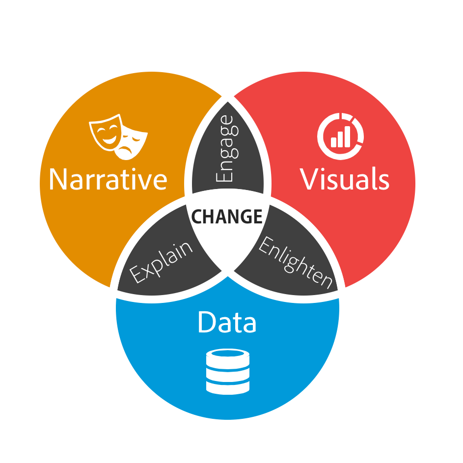
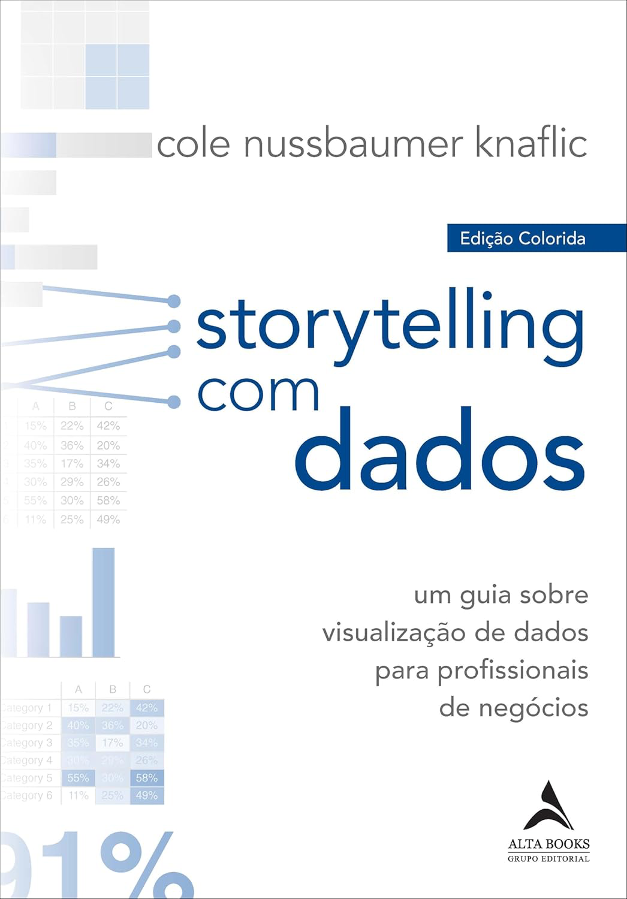
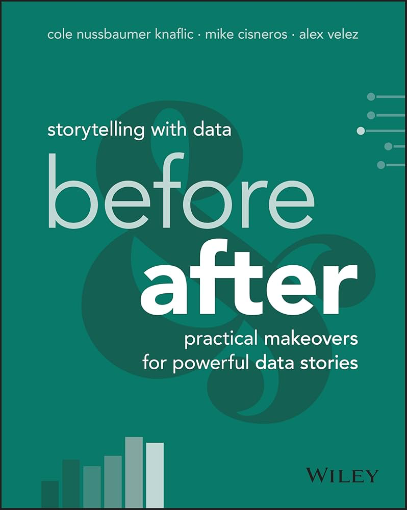
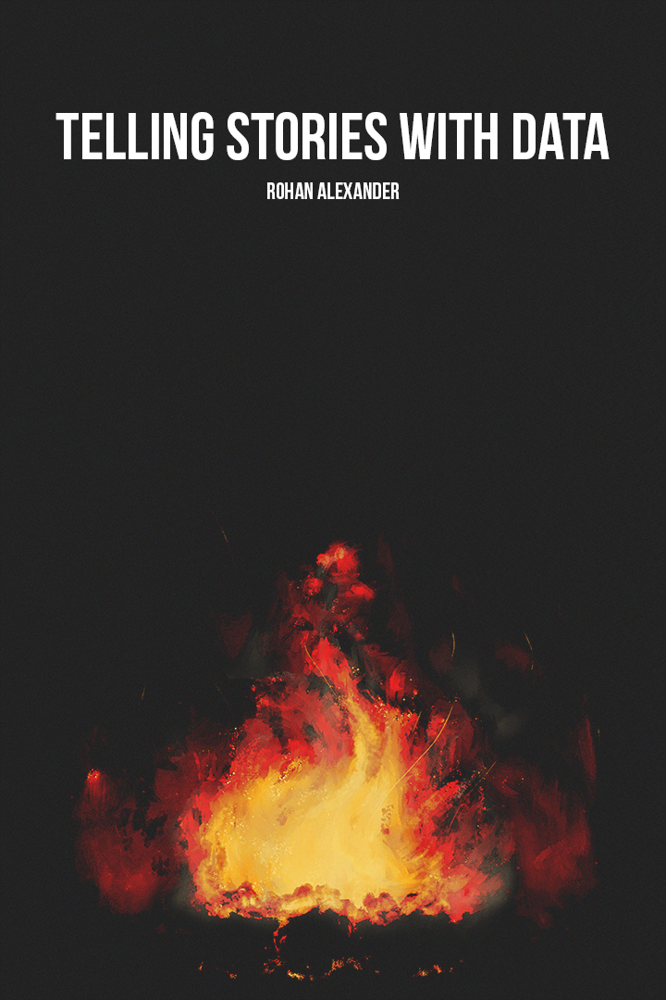
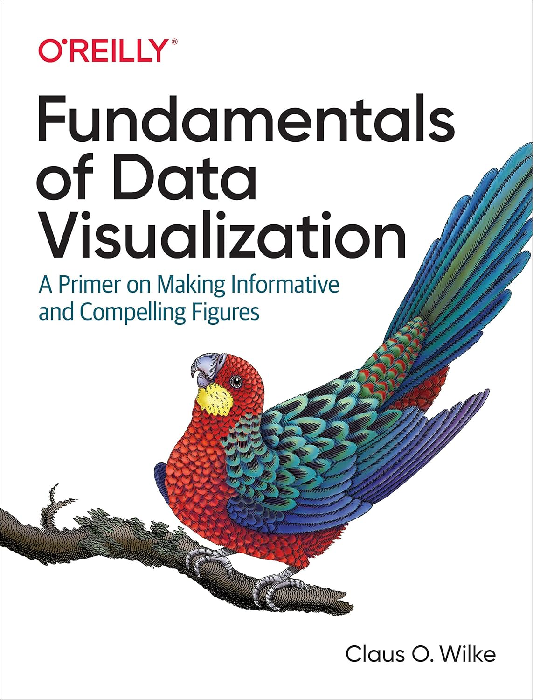
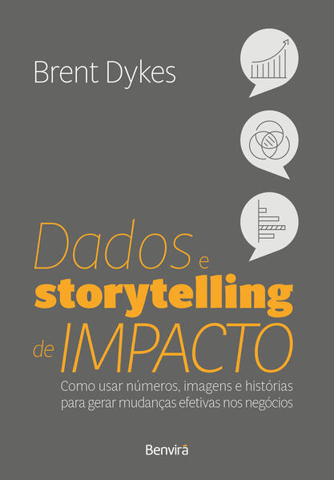
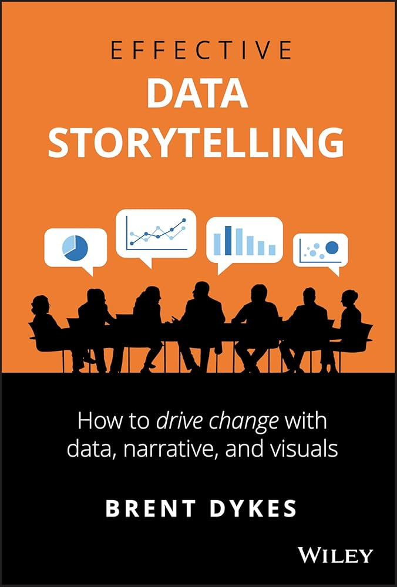

```{=html}
<style>
p {
  text-align: justify;
}
</style>
```

Quando o assunto é comunicar dados, muitas vezes surge a dúvida: usar uma tabela ou um gráfico? Embora as tabelas tenham seu valor, especialmente quando precisamos consultar números exatos, os gráficos quase sempre são mais eficazes para transmitir uma mensagem de forma clara e rápida.

Isso acontece porque as tabelas conversam com o nosso sistema verbal — nós lemos linha por linha, coluna por coluna, e só então interpretamos os valores. Já os gráficos falam diretamente com o nosso sistema visual. Em segundos, conseguimos perceber padrões, identificar tendências, comparar grupos e até notar discrepâncias que passariam despercebidas em meio a uma tabela cheia de números.

A visualização de dados é a representação e apresentação de dados de maneira a explorar a nossa habilidade de percepção visual com a finalidade de aumentar a compreensão. Ademais, é uma prática interdisciplinar, que combina arte e ciência, permitindo que os dados sejam compreendidos de maneira mais intuitiva e impactante. - Andy Kirk

A narrativa de dados é uma forma estruturada de comunicar insights obtidos a partir de dados, integrando três componentes essenciais: **dados, elementos visuais e narrativa**. Quando a narrativa se alia aos dados, ela fornece contexto e significado, ajudando o público a compreender o que está acontecendo e por que uma descoberta é relevante. Os recursos visuais, por sua vez, tornam visíveis padrões e tendências que poderiam passar despercebidos em simples tabelas numéricas, revelando insights ocultos em linhas e colunas. Por fim, quando narrativa e visualização se unem de forma coerente, é possível envolver, inspirar e até entreter o público. Assim como o cinema nos cativa ao contar histórias que nos transportam para outros mundos, uma boa narrativa de dados — apoiada em elementos visuais eficazes e informações relevantes — tem o poder de influenciar decisões e promover mudanças significativas. - Brent Dykes

{fig-align="center" width="233"}

Nesse contexto, o **storytelling with data (contar histórias com dados)** é a prática de transformar informações brutas em narrativas visuais e compreensíveis que facilitam a tomada de decisão. Não se trata apenas de apresentar gráficos ou tabelas, mas de organizar os dados de forma que eles contem uma história clara, relevante e impactante para o público-alvo. Elementos como contexto, comparação e destaque de padrões ou insights ajudam a guiar o espectador pelo raciocínio que os números revelam. Um bom storytelling com dados conecta fatos à ação, mostrando não apenas “o que aconteceu”, mas também “por que isso importa” e “o que pode ser feito a partir disso”.

Além disso, a eficácia do storytelling com dados depende da escolha adequada de visualizações e da simplicidade na comunicação. Gráficos complexos ou excesso de informação podem confundir mais do que esclarecer. A combinação de design visual, cores, títulos claros e narrativa lógica torna os dados mais acessíveis e memoráveis. Esse tipo de abordagem é essencial em ambientes corporativos, acadêmicos e jornalísticos, onde convencer, influenciar decisões ou gerar compreensão rápida é crucial. Ao final, a arte do storytelling com dados está em transformar números em insights compreensíveis e acionáveis, criando uma ponte entre análise e comunicação.

Nesse cenário, a linguagem R se destaca por unir ciência de dados e comunicação em um só espaço. Mais do que uma linguagem de análise, ele funciona como um ambiente integrado onde dados, métodos estatísticos e narrativas visuais dialogam de forma fluida.

Este livro apresenta os fundamentos e as boas práticas da visualização de dados, explorando como transformar informações em representações visuais claras, impactantes e acessíveis. Mostra que a visualização de dados não é apenas um recurso estético, mas uma poderosa ferramenta de comunicação que alia ciência e arte. A partir de exemplos práticos no R, pretende-se desenvolver no leitor a capacidade de criar visualizações que não apenas informem, mas também inspirem e promovam a compreensão.

**Recomendações:**

[{width="150"}](https://www.storytellingwithdata.com/blog)

[{width="150"}](https://community.storytellingwithdata.com)

[{width="150"}](https://www.storytellingwithdata.com/books)

[{width="150"}](https://tellingstorieswithdata.com)

[{width="150"}](https://clauswilke.com/dataviz/)

{width="150"}

{width="150"}

**Autores:**

[Wanessa Alves Lima](https://www.linkedin.com/in/wanessa-alves-lima-67028a252)

[{width="180"}](https://www.linkedin.com/in/wanessa-alves-lima-67028a252)

::: {style=".justified-text"}
Bióloga pela Universidade Estadual do Piauí – UESPI (2022). Mestre (2024) e Doutoranda (2024-) em Genética e Melhoramento pela Universidade Federal de Viçosa – UFV. Possui experiência nas áreas de Mutagênese, Citogenética Molecular, Bioinformática, Genética Quantitativa, Melhoramento de Plantas e Estatística. Atualmente, trabalha com Seleção Genômica, utilizando modelos Estatísticos e de Machine e Deep Learning.
:::

[Gabriel Ferreira Paiva](https://www.linkedin.com/in/gabriel-ferreira-paiva-061429184)

[{width="180"}](https://www.linkedin.com/in/gabriel-ferreira-paiva-061429184)

::: {style=".justified-text"}
Engenheiro Agrônomo pelo Instituto Federal do Mato Grosso do Sul - IFMS (2021). Mestre (2022) e Doutorando (2022-) em Fitopatologia pela Universidade Federal de Viçosa – UFV. Possui experiência com testes de eficácia de fungicidas, epidemiologia, análise de dados e manejo de doenças em plantas, principalmente com ênfase no manejo e controle de giberela em trigo e de podridões de colmo e espigas em milho.
:::
